# Report

This report details the implementation and results of a simplified facial recognition system using Principal Component Analysis (PCA), Autoencoders, and Denoising Autoencoders.

## (a) Mean Vector and Eigenfaces

The mean face and the top 4 eigenfaces are plotted below. The eigenfaces represent the principal components of the face data and can be thought of as fundamental "face ingredients".

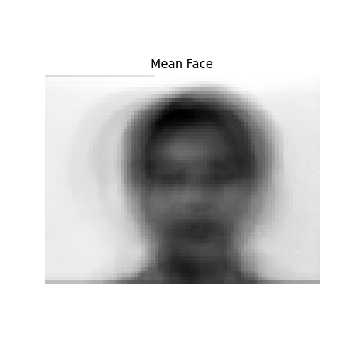
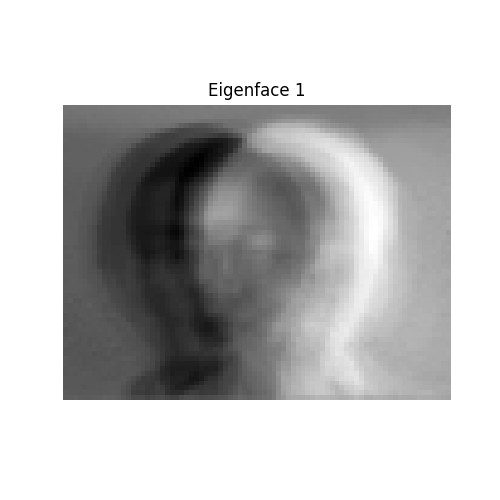
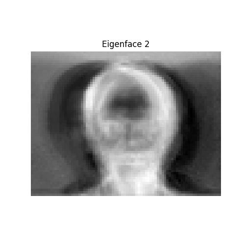
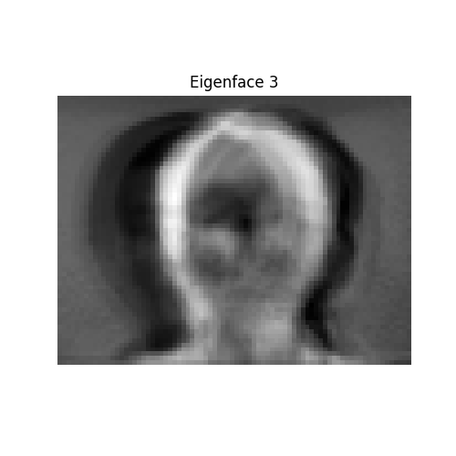
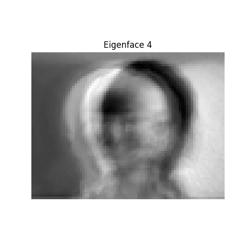

## (b) Training Curves

The training curves for the Autoencoder and Denoising Autoencoder, showing the averaged squared error as a function of epochs, are plotted below.

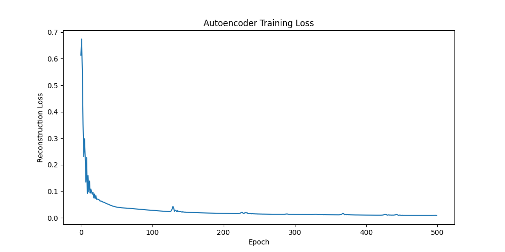
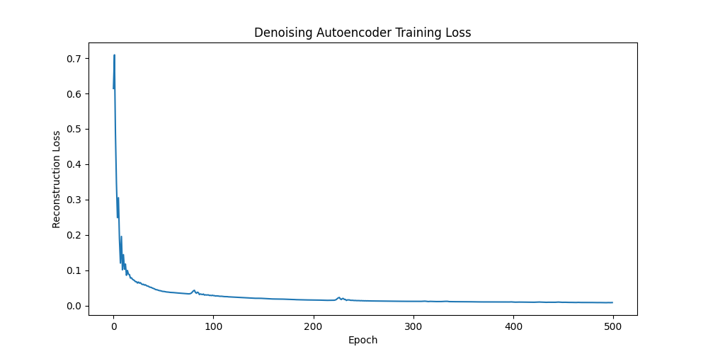

## (c) Image Reconstruction and Mean Squared Error

The original image and the images reconstructed using PCA, Autoencoder, and Denoising Autoencoder are shown side by side below. The mean squared error between the original image and each reconstructed image is also listed.

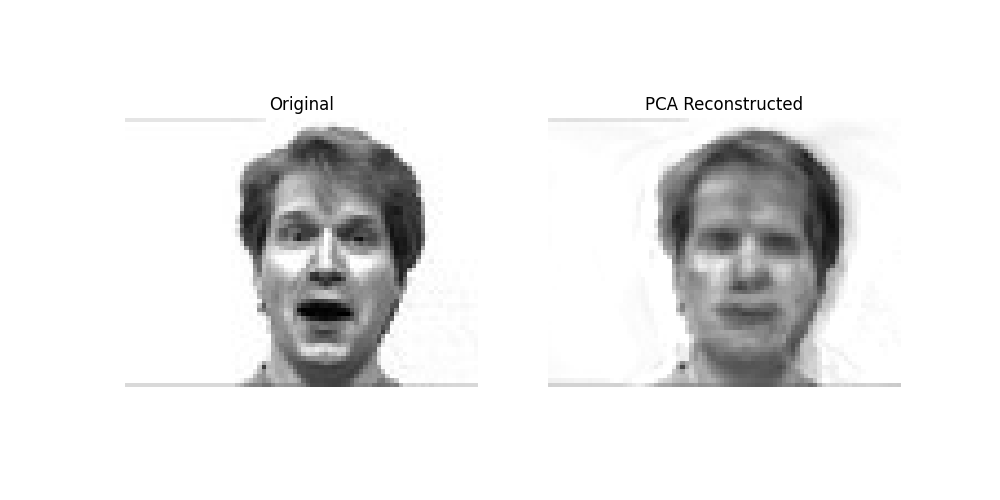
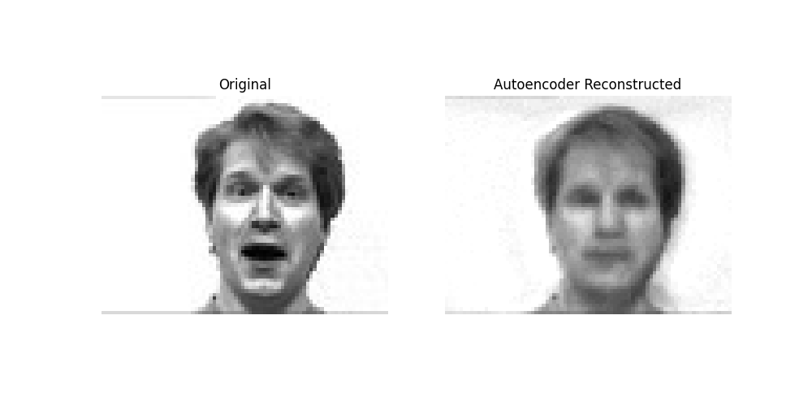
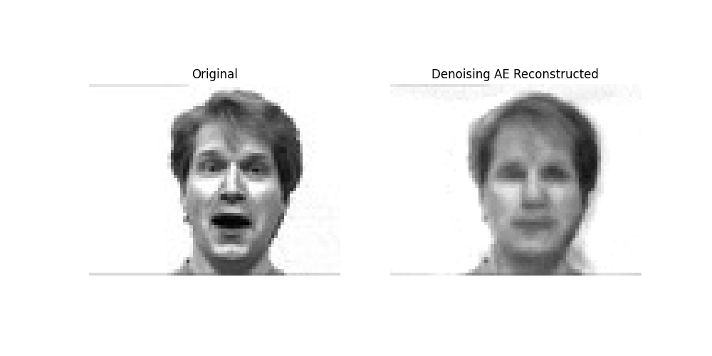

Mean Squared Error:

- PCA: 0.010710
- Autoencoder: 0.013231
- Denoising Autoencoder: 0.013431

## (d) Denoising Autoencoder Architecture Modification

Based on the training logs, three different architectures were tested: default, shallow, and deep. The training loss curves and final reconstruction losses indicate their performance:

- **Default Architecture:** Achieved a final reconstruction loss of approximately 0.0157 and 0.0131 in two separate runs. The training loss decreased steadily over 500 epochs.
- **Shallow Architecture:** Showed higher training losses throughout the 500 epochs and resulted in higher final reconstruction losses (approximately 0.0197 and 0.0184). This suggests that a shallower network may not have sufficient capacity to capture the underlying data structure effectively for this task.
- **Deep Architecture:** Demonstrated lower training losses compared to the shallow architecture and achieved the lowest final reconstruction losses (approximately 0.0138 and 0.0142). This indicates that a deeper network can potentially learn more complex representations and achieve better reconstruction performance.

The training loss for different Denoising Autoencoder architectures is shown below.

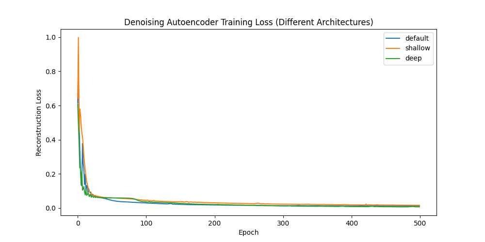

## (e) Optimizer Comparison for Denoising Autoencoder

Based on the training logs, four different optimizers were compared: Adam, Adagrad, Adadelta, and SGD. Their performance can be analyzed by observing their training loss curves:

- **Adam:** Showed the fastest convergence and achieved the lowest training loss among the tested optimizers within 500 epochs.
- **Adagrad:** Converged slower than Adam and reached a higher final training loss.
- **Adadelta:** Exhibited very slow convergence and the training loss remained significantly higher compared to Adam and Adagrad throughout the 500 epochs.
- **SGD:** Also showed slow convergence and high training loss, similar to Adadelta, within the given number of epochs.

These results suggest that Adam is the most suitable optimizer among the tested ones for training the Denoising Autoencoder on this dataset, offering faster convergence and better performance in terms of minimizing the training loss.

The training loss for the Denoising Autoencoder with different optimizers is shown below.

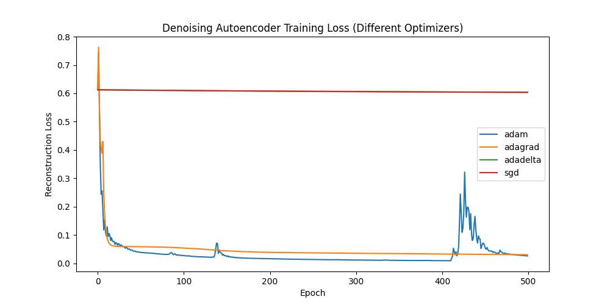
