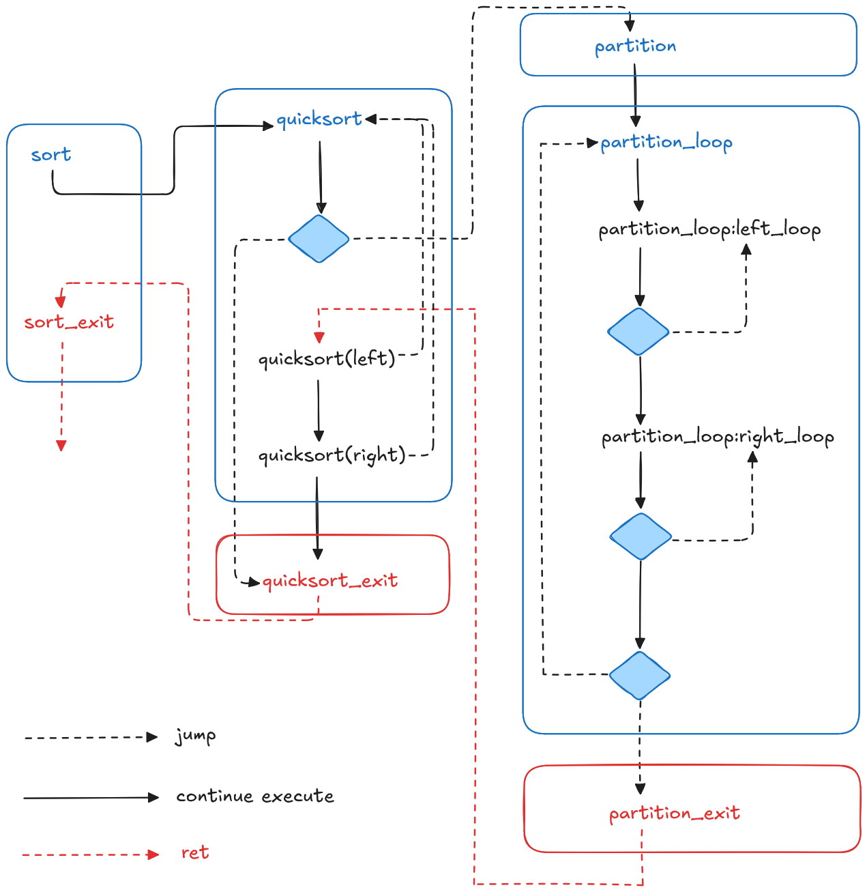

資工三 b11902038 鄭博允

---

其實就是直接根據 wikipedia 上的 pesudo code 來直接轉換成 RISC-V。

首先，根據 pesudo code 將所有需要 jump 的地方，像是 exit 還有 loop，將這些部分獨立出來，並分成不同區塊，每個區塊的關係如下:

以下分別講解每個區塊的程式:

## sort(addr, count)
1. 將 return address (ra) 存起來
2. 取得 quicksort 需要的參數
  - a0 原本就是 A 的 base addr 所以不用動
  - a2 = a1 (count) - 1
  - a1 = 0
3. 呼叫 quicksort
4. 復原 ra
5. ret

## quicksort(addr, lo, hi)
### quicksort
1. 將 return address 存起來
2. 因為之後遞迴呼叫 quicksort 時會用到 a0, a1, a2，所以必須先將裡面原本的值 (addr, lo, hi) 存到 s0, s1, s2 內
3. 如果不符合條件，則跳到 quicksort_exit
4. 呼叫 partition (參數就是 a0, a1, a2，不需要動)
5. 將 partition 的回傳值 (存在 a0) 移動到 t0 暫存
6. 依序呼叫兩次 quicksort (參數的部分就不再贅述，反正就是將需要的數值移動到 a0, a1, a2)
7. 接續 quicksort_exit

### quicksort_exit
1. 復原 ra, s0, s1, s2
2. ret

## partition(addr, lo, hi)
在這個部分，我使用了 t0 ~ t5 來暫存會用到的數值:
- t0 用來暫存取得 A[] 值時需要的 address
- t1 用來暫存 left index i
- t2 用來暫存 right index j
- t3 用來暫存 A[lo] 的值 (pivot)
- t4 用來暫存 A[i] 的值
- t5 用來暫存 A[j] 的值

### partition
1. 將 return address 存起來
2. 將 A[lo] 存到 t3
3. 計算 i 的值並存到 t1
4. 計算 j 的值並存到 t2
5. 接續 partition_loop

### partition_loop
#### left_loop
1. 將 t1 加上一
2. 將 A[t1] 的值存到 t4
3. 如果不符合條件，跳回 left_loop，否則繼續

#### right_loop
1. 將 t2 減掉一
2. 將 A[t2] 的值存到 t5
3. 如果不符合條件，跳回 right_loop，否則繼續

#### partition_loop cont.
1. 如果不符合條件，跳到 partition_exit
2. 將 t4 的值存到 A[t2]
3. 將 t5 的值存到 A[t1] (其實就是互換 A[i] 和 A[j])
4. 跳回 partition_loop

### partition_exit
1. 將 t2 作為返回值存到 a0
2. 復原 ra
3. ret