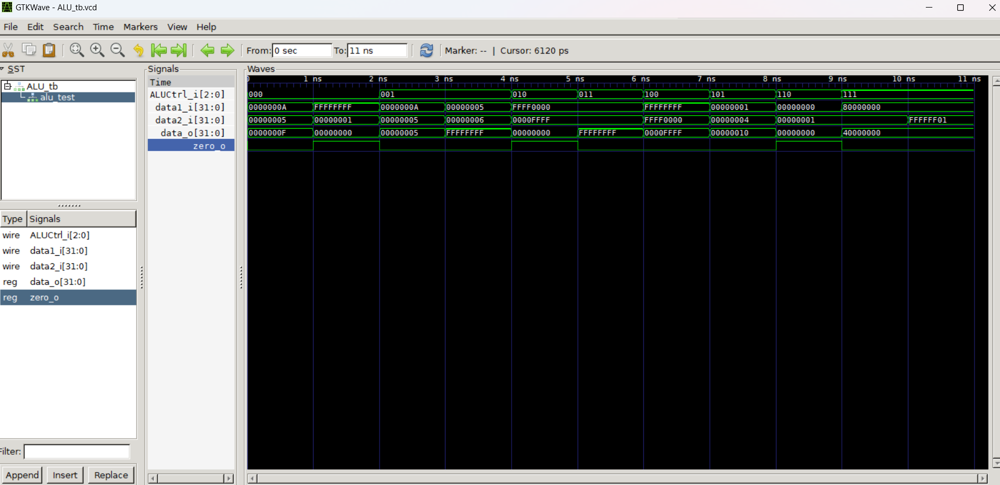

# ALU Module
## Design
ALU 的設計基本上以 case 為主體，用來判斷 `ALUCtrl_i` 所代表的 operation 並執行，比較重要的實作重點如下:
1. zero flag: 在得到結果 `data_o` 後利用三元運算子來判斷 `zero_o`
2. overflow: C 的 unsigned int 和 Verilog 的處理方式很像，加法溢位時會捨棄高位、減法為負數時會換成 2's complement，所以實際上沒有做特別的處理
3. arithmetic right shift: Verilog 默認會將 `data1_i` 視為 unsigned，所以使用 `$signed(data1_i)` 強制轉換成 signed，這樣在右移時就會補上 sign bit

## Testing
### Testbench
我總共寫了 11 個 testcases: 8 個功能各一個、2 個測試 add sub overflow、1 個測試大數值 shift。
詳細的描述如下:
| testcase                             | `data1_i`   | `data2_i`   | `ALUCtrl_i` | expected `data_o` | expected `zero_o` |
| ------------------------------------ | ----------- | ----------- | ----------- | ----------------- | ----------------- |
| addition                             | 0x0000_000A | 0x0000_0005 | 000         | 0x0000_000F       | 0                 |
| addition (overflow)                  | 0xFFFF_FFFF | 0x0000_0001 | 000         | 0x0000_0000       | 1                 |
| subtraction                          | 0x0000_000A | 0x0000_0005 | 001         | 0x0000_0005       | 0                 |
| subtraction (overflow)               | 0x0000_0005 | 0x0000_0006 | 001         | 0xFFFF_FFFF       | 0                 |
| bitwise and                          | 0xFFFF_0000 | 0x0000_FFFF | 010         | 0x0000_0000       | 1                 |
| bitwise or                           | 0xFFFF_0000 | 0x0000_FFFF | 011         | 0xFFFF_FFFF       | 0                 |
| bitwise xor                          | 0xFFFF_FFFF | 0xFFFF_0000 | 100         | 0x0000_FFFF       | 0                 |
| left shift                           | 0x0000_0001 | 0x0000_0004 | 101         | 0x0000_0010       | 0                 |
| arithmetic right shift               | 0x0000_0000 | 0x0000_0001 | 110         | 0x0000_0000       | 1                 |
| logical right shift                  | 0x8000_0000 | 0x0000_0001 | 111         | 0x4000_0000       | 0                 |
| logical right shift (shift > 5 bits) | 0x8000_0000 | 0xFFFF_FF01 | 111         | 0x0000_0001       | 0                 |

### Command & Result
依序在 powershell 輸入以下指令:
```bash
iverilog -o ALU_tb.vvp ALU.v ALU_tb.v   # 編譯產生 ALU_tb.vvp
vvp ALU_tb.vvp                          # 執行
gtkwave ALU_tb.vcd                      # 用 gtkwave 打開結果
```

結果圖如下:



# Registers Module
## Design
1. 用 reg array 來代表 32 個 32 bits register，因此我們就能把 `RS1addr_i` 視為陣列的 index 來執行 read
    ```verilog
    reg [31:0] registers [31:0]
    assign RS1data_o = registers[RS1addr_i];
    assign RS2data_o = registers[RS2addr_i];
    ```

2. 將 register 0 指定成 0
    ```verilog
    initial begin
        registers[0] = 32'b0;
    end
    ```

3. write 的部分會在 `clk_i` 正緣的執行，然後檢查 `RegWrite_i` 是否為 1，同時如果寫入對象是 register 0 (`RDaddr_i == 0`) 也不執行
    ```verilog
    always @(posedge clk_i) begin
        // ignore writes to register 0
        if (RegWrite_i && RDaddr_i != 5'b00000) begin
            registers[RDaddr_i] <= RDdata_i;
        end
    end
    ```

## Testing
### Testbench
這個 testbench 為了在不同 testcase 之間可以重置 registers，我使用了 task 的方式來寫，並且依序執行。
```verilog
initial begin
    $dumpfile("Registers_tb.vcd");
    $dumpvars(0, Registers_tb);

    reset_signals(); testcase1();
    reset_signals(); testcase2();
    reset_signals(); testcase3();
    reset_signals(); testcase4();

    $finish;
end
```

同時設定一個 10ns 的 clock 來模擬 `clk_i` 的輸入:
```verilog
initial begin
    clk_i = 0;
    forever #5 clk_i = ~clk_i;
end
```

總共有 4 個 testcase，詳細描述如下:
#### testcase1: 寫入 register 0
```verilog
RS1addr_i = 5'b00000;
RDaddr_i = 5'b00000;
RDdata_i = 32'hFFFF_FFFF;
RegWrite_i = 1'b1;
#10;
RegWrite_i = 1'b0;
#10;
```

#### testcase2: 當 RegWrite_i 是 low 的時候寫入
```verilog
RS1addr_i = 5'b00001;
RDaddr_i = 5'b00001;
RDdata_i = 32'hFFFF_FFFF;
RegWrite_i = 1'b0;
#10;
```

#### testcase3: 寫入單個 register 並讀取
```verilog
RS1addr_i = 5'b00001;
RDaddr_i = 5'b00001;
RDdata_i = 32'hFFFF_FFFF;
RegWrite_i = 1'b1;
#10;
RegWrite_i = 1'b0;
#10;
```

#### testcase4: 寫入多個 register 並讀取
```verilog
RS1addr_i = 5'b00010;
RS2addr_i = 5'b00011;
RDaddr_i = 5'b00010;
RDdata_i = 32'hFFFF_FFFF;
RegWrite_i = 1'b1;
#10;
RDaddr_i = 5'b00011;
RDdata_i = 32'h1111_1111;
#10;
RegWrite_i = 1'b0;
#10;
```

### Command & Result
指令和前面一樣，只是檔案名字不同，就不贅述。
gtkwave 的結果圖如下:
